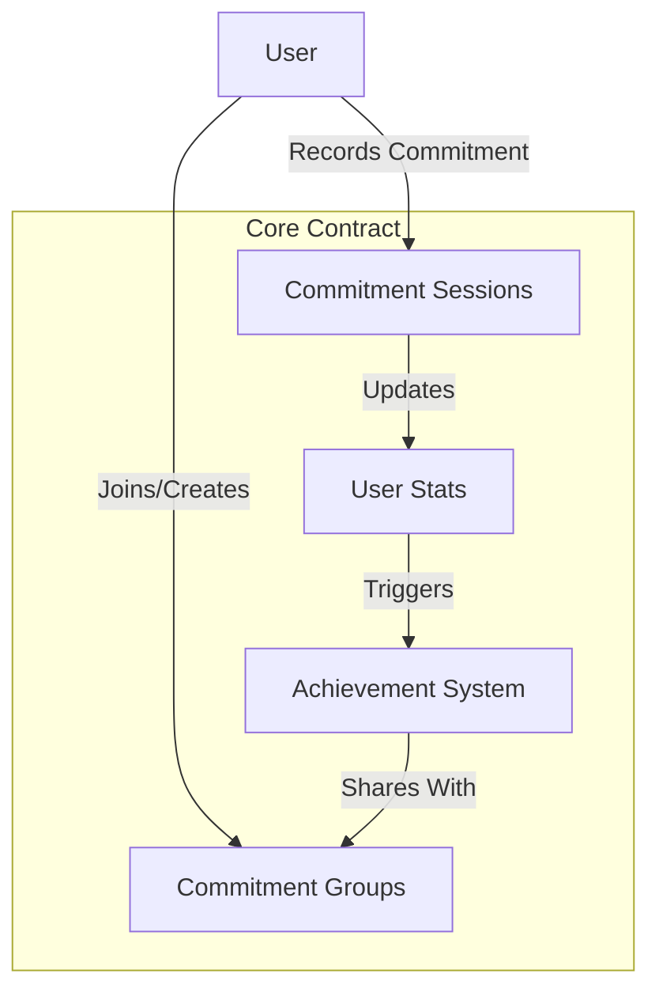

# Optimism Schedule 🕒

## Overview

**Optimism Schedule** is a smart contract system designed to help users track, manage, and achieve their time-based commitments on the Stacks blockchain. By providing a robust, transparent, and decentralized framework, this project enables individuals and teams to create, monitor, and validate their scheduled activities.

## Key Features

- 📅 Flexible Scheduling
- 🏆 Achievement Tracking
- 🤝 Group Commitment Support
- 🔒 Secure and Transparent

## Architecture

The system leverages a core smart contract that manages:
- Commitment recording
- Achievement tracking
- Group collaboration
- Progress statistics



## Getting Started

### Prerequisites
- Clarinet
- Stacks wallet
- Basic understanding of blockchain commitments

### Basic Usage

1. Record a commitment:
```clarity
(contract-call? .optimism-core record-commitment 
    u60  ;; duration in minutes
    u1   ;; commitment type
    none ;; optional notes
)
```

2. Create a commitment group:
```clarity
(contract-call? .optimism-core create-commitment-group 
    "Project Accountability" 
    "Group for tracking professional development"
)
```

## Function Reference

### Public Functions
- `record-commitment`
- `create-commitment-group`
- `join-commitment-group`
- `verify-achievement`

### Read-Only Functions
- `get-user-stats`
- `get-commitment-session`

## Development

### Testing
```bash
clarinet test
```

### Local Development
```bash
clarinet console
```

## Security Considerations

### Limitations
- Group membership capped at 100 members
- Achievement tracking limited to 100 entries
- Commitment types restricted to predefined categories

### Best Practices
- Validate all input parameters
- Verify group membership before operations
- Check achievement authenticity before sharing

## Contributing

Contributions welcome! Read our [Contributing Guidelines](CONTRIBUTING.md).